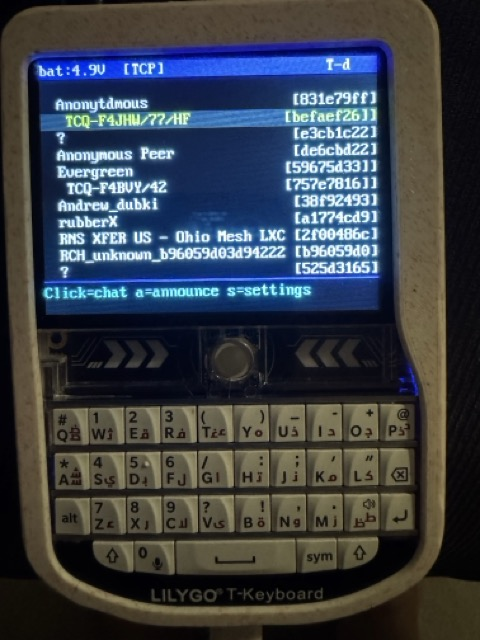

# T-Deck LXMF Messenger

Standalone LoRa + TCP messaging device running on the LilyGO T-Deck v1.
Uses [micropython-reticulum](https://github.com/varna9000/micropython-reticulum/README.md) for Reticulum-compatible encrypted messaging over LoRa or WiFi TCP.


**NB! App supports only opportunistic messaging. Link messages will not work!.**




## Hardware

- **Board**: LilyGO T-Deck v1 (ESP32-S3)
- **Radio**: Semtech SX1262 LoRa transceiver (shared SPI bus with display)
- **Display**: ST7789 320x240 TFT (landscape)
- **Input**: QWERTY keyboard (I2C) + trackball with click button
- **Audio**: MAX98357A I2S amplifier — chirp on RX, blip on TX
- **Battery**: LiPo with ADC voltage monitoring

## Setup

### 1. Install mpremote

`mpremote` is the official MicroPython tool for transferring files and managing the board over USB.

**macOS (Homebrew):**
```
brew install mpremote
```

**pip (any platform):**
```
pip install mpremote
```

**uv (any platform):**
```
uv tool install mpremote
```

Verify it works:
```
mpremote connect list
```
You should see your T-Deck listed as a USB serial device. If not, check your USB cable (must be data-capable, not charge-only).

### 2. Flash MicroPython

Flash MicroPython v1.22+ for ESP32-S3 to the T-Deck.

Download from: https://micropython.org/download/ESP32_GENERIC_S3/

### 3. Install LoRa driver

```
mpremote mip install lora-sx126x
mpremote mip install lora-sync
```

### 4. Upload files

Upload the `urns/` library and T-Deck files:

```
# Upload uP-reticulum library
mpremote cp -r urns/ :/lib/urns/

# Upload T-Deck app files
mpremote cp t-deck/tdeck_node.py t-deck/tdeck_config.py t-deck/ui.py :
mpremote cp t-deck/sound.py t-deck/st7789py.py t-deck/vga2_8x16.py :
```

### 5. Configure

Edit `tdeck_config.py`:

- `NODE_NAME` — default display name broadcast in announces (default: `"T-Deck"`). Can be changed at runtime from Settings.
- `DEBUG` — `0` = silent, `1` = basic, `2` = verbose
- `LORA_CONFIG` — radio parameters (frequency, SF, BW, TX power, syncword)
- `TCP_CONFIG` — default TCP server address and port for WiFi mode

Default radio settings: **868 MHz, SF7, BW125, CR5, 14 dBm, syncword 0x1424**.
These are compatible with RNode firmware and reference Reticulum.

Default TCP settings: connects to `TCP_CONFIG["target_host"]` on port `4242`. The remote machine needs a Reticulum `TCPServerInterface` listening on that port.

### 6. Run

```python
import tdeck_node
```

Or set as `main.py` for autostart:

```
mpremote cp t-deck/tdeck_node.py :/main.py
```

## Usage

### Node List Screen

The device starts on the node list screen showing discovered peers. Peers with unread messages are marked with `*` and bubbled to the top of the list.

| Action | Input |
|---|---|
| Select peer | Trackball up/down |
| Open chat | Trackball click |
| Send announce | Press `a` |
| Open settings | Press `s` |

### Chat Screen

| Action | Input |
|---|---|
| Type message | Keyboard |
| Send message | Enter |
| Scroll history | Trackball up/down |
| Back to node list | Backspace (empty input) or Escape |

Message delivery status is shown after each sent message:
- `..` — pending (waiting for delivery confirmation)
- checkmark — delivered
- `!` — failed (no acknowledgement received)

### Settings

Press `s` from the node list to open settings. Navigate with trackball, select with trackball click, go back with backspace.

**WiFi** — Scan for networks, select one, enter password. After connecting, the TCP host entry page opens automatically.

**TCP** — Connect to a remote Reticulum node over WiFi. When TCP is OFF, click to enter a server address (pre-filled with the last used address or the default from `tdeck_config.py`). When TCP is ON, click to disconnect — this also disconnects WiFi and restarts LoRa. Only one interface (LoRa or TCP) is active at a time.

**Name** — Change the node's display name. Saved to flash and persisted across reboots.

All settings (WiFi credentials, TCP host/port, node name, TCP enabled state) are saved to `/rns/settings.json` and restored on boot. If WiFi and TCP were enabled when the device was last used, they reconnect automatically on startup.

### Status Bar

Top bar shows: battery voltage, active interface (`[LoRa]` or `[TCP]`), RSSI of last received packet, node name, and `[A]` flash on announce.

## Networking

### LoRa (default)

LoRa is the default interface, active on boot. All Reticulum peers within radio range are discovered automatically via announces.

### TCP over WiFi

The T-Deck can connect to a remote Reticulum node over WiFi using a TCP client interface with HDLC framing. This is useful for bridging to the wider Reticulum network.

The remote node needs a `TCPServerInterface` in its Reticulum config:

```
[[TCP Server Interface]]
  type = TCPServerInterface
  interface_enabled = True
  listen_ip = 0.0.0.0
  listen_port = 4242
```

When TCP is activated, LoRa is stopped (only one interface at a time). When TCP is deactivated, WiFi is disconnected and LoRa restarts.

**Why TCP instead of UDP?** The ESP32 cannot reliably receive UDP broadcast packets, even with power saving disabled. TCP provides reliable bidirectional communication.

## Pin Map

| Function | Pin(s) |
|---|---|
| SPI SCK/MOSI | 40, 41 |
| Display CS/DC/BL | 12, 11, 42 |
| LoRa CS/RST/BUSY/DIO1/MISO | 9, 17, 13, 45, 38 |
| Keyboard SCL/SDA/PWR | 8, 18, 10 |
| Trackball U/D/L/R/Click | 3, 15, 1, 2, 0 |
| Speaker BCK/WS/DOUT | 7, 5, 6 |
| Battery ADC | 4 |

## Architecture

```
tdeck_node.py     Main entry: init hardware, wire LXMF callbacks to GUI
tdeck_config.py   Pin definitions, radio parameters, TCP config, node name
ui.py             Async GUI: node list, chat, settings screens, diff-based drawing
sound.py          I2S notification tones (RX chirp, TX blip)
st7789py.py       ST7789 display driver (pure Python)
vga2_8x16.py      8x16 VGA font
```

### SPI Bus Sharing

Display and LoRa share SPI1 (SCK=40, MOSI=41). Bus arbitration is CS-based only — display CS is deasserted during LoRa operations and vice versa. No SPI reinit at runtime.

### Display Optimization

The GUI uses diff-based drawing: a 15-row cache tracks what's currently on screen. Only changed rows trigger SPI writes, reducing traffic by ~80% on typical redraws. The trackball uses edge detection (HIGH-to-LOW transitions) to prevent noisy pins from flooding scroll events.

### Interface Switching

Only one network interface is active at a time. Switching from LoRa to TCP stops the LoRa radio and deregisters it from Transport. Switching back closes the TCP socket, disconnects WiFi, and re-initializes LoRa. The peer list and chat history are cleared on each switch since peers from one interface won't be reachable on the other.

### Settings Persistence

Settings are stored as JSON in `/rns/settings.json` on the device flash. Saved fields: `wifi_ssid`, `wifi_pass`, `tcp_enabled`, `tcp_host`, `tcp_port`, `node_name`. On boot, WiFi and TCP are automatically restored if they were active in the previous session.

### SX1262 Notes

- **DC-DC regulator mode** is required for TX (`use_dcdc: True`). The driver defaults to LDO which produces no RF output on the T-Deck.
- **TCXO supply** must be set to 3.3V (`dio3_tcxo_millivolts: 3300`). Without it, modem init fails.

## Files

| File | Description |
|---|---|
| `tdeck_node.py` | Main app — hardware init, Reticulum/LXMF setup, async event loop |
| `tdeck_config.py` | All pin definitions, radio config, and TCP config |
| `ui.py` | GUI state machine with cached drawing and async keyboard/trackball |
| `sound.py` | I2S tone generation for RX/TX notifications |
| `st7789py.py` | Pure Python ST7789 driver |
| `vga2_8x16.py` | Bitmap font (8x16 pixels per character, 40 columns) |
