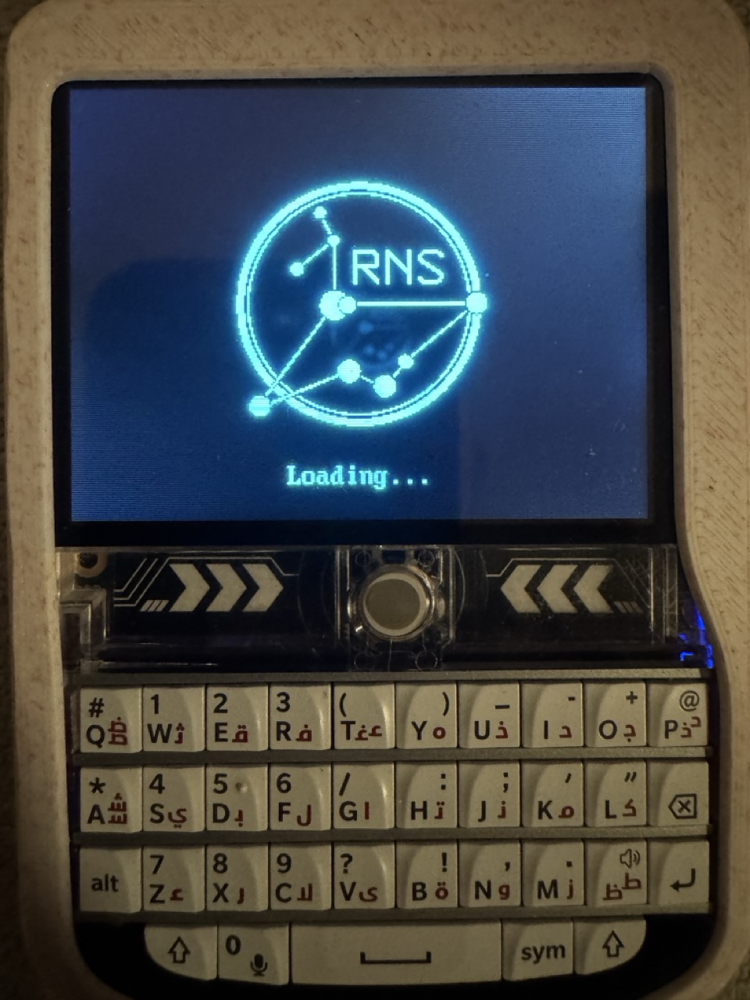
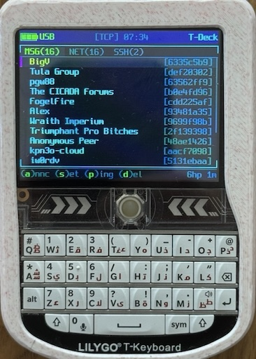
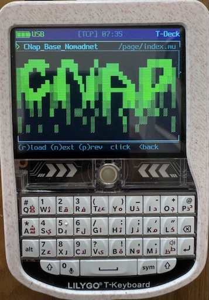
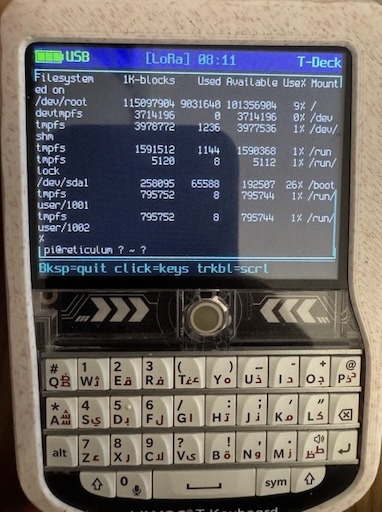

# T-Deck LXMF Messenger

A handheld messenger for the LilyGO T-Deck. It works with no phone signal, no
wifi and no internet — the devices talk to each other directly over long-range
radio, up to several kilometres. If wifi is available it can use that instead.
Everything you send is encrypted, and there is no account to sign up for.

It runs on the [Reticulum](https://reticulum.network/) network, so it can reach
anyone else on that network, not only other T-Decks.

**What you can do with it**

- Send and receive text messages
- Send photos, and view the ones you receive on screen
- Record short voice messages and play the ones people send you
- Read pages that others publish on the network
- Open a command line on a remote computer

Text displays in English as well as Bulgarian, Russian, Ukrainian and Belarusian.


<p>


</p>
<p>


</p>

## Releases now ship through M5Launcher

From this release on, the firmware is published for **[M5Launcher](https://github.com/bmorcelli/Launcher)**:
copy the `.bin` onto a microSD card and install it from the Launcher's menu on the device. No cable,
no drivers, no download-mode button combination. The Launcher stays on the T-Deck afterwards, so you
can keep other firmware alongside this one and switch between them.

Get M5Launcher: **[github.com/bmorcelli/Launcher](https://github.com/bmorcelli/Launcher)** ·
[downloads](https://github.com/bmorcelli/Launcher/releases)

Flashing over USB still works and is described below — you need it once, to put the Launcher on a
T-Deck that does not have it yet.

## Hardware

- **Board**: LilyGO T-Deck v1 (ESP32-S3)
- **Radio**: Semtech SX1262 LoRa transceiver (shared SPI bus with display)
- **Display**: ST7789 320x240 TFT (landscape)
- **Input**: QWERTY keyboard (I2C) + trackball with click button
- **Audio**: MAX98357A I2S amplifier + ES7210 ADC microphone — Codec2 voice messaging
- **Battery**: LiPo with ADC voltage monitoring

## Setup

### Option A: Install with M5Launcher (recommended)

1. If the T-Deck does not have [M5Launcher](https://github.com/bmorcelli/Launcher) on it yet, put it
   there once: download `Launcher-lilygo-t-deck.bin` from its
   [releases](https://github.com/bmorcelli/Launcher/releases) and flash it over USB (Option B covers
   how to flash).
2. Download `tdeck_firmware.bin` from this project's
   [latest release](https://github.com/varna9000/reticulum-tdeck/releases/latest) and copy it onto a
   microSD card.
3. Put the card in the T-Deck, start the Launcher, find the file on the card and choose **Install**.
4. It restarts into the messenger when it finishes.

Switching the T-Deck off and on again brings up the Launcher first, and the messenger starts by
itself a couple of seconds later. That is the Launcher doing its job — it stays on the device so you
can install other firmware later and choose between them.

Note that installing this way replaces the app's storage area, so the device comes up with a new
identity and an empty message history, exactly as it would after flashing over USB. Back up anything
you want to keep first.

### Option B: Flash over USB

One file contains everything — MicroPython, the display driver, the radio drivers and all app code.
One flash, no extra steps. You need this at least once, to put the Launcher (or the messenger) onto
a brand-new T-Deck.

**Requirements:** `esptool` (`pip install esptool` or `brew install esptool`)

**Flash:**
```bash
esptool --chip esp32s3 --port /dev/cu.usbmodem* erase-flash
esptool --chip esp32s3 --port /dev/cu.usbmodem* write-flash 0x0 tools/firmware_build/tdeck_firmware.bin
```

The T-Deck must be in **download mode** to flash: short GPIO0 to GND while pressing reset, then release. The device boots automatically after flashing.

**What's in the firmware:**

| Layer | Contents |
|---|---|
| **Frozen in ROM** | ui.py, sound.py, es7210.py, micron.py, nomad_browser.py, rnsh_proto.py, rnsh_client.py, terminal.py, display fonts (spleen_8x16 + shell grids), the SX1262 driver (lora/, vendored in `lib/lora`), full urns/ stack (reticulum, Channel, LXMF, crypto, interfaces) |
| **C drivers in ROM** | Russ Hughes st7789_mpy (DMA-accelerated ST7789 display) + the codec/crypto modules: ed25519_fast, bz2_fast, codec2_fast, tjpgd_fast, webp_fast |
| **On filesystem** | main.py (tdeck_node.py), tdeck_config.py, logo.jpg |

Frozen modules execute directly from flash ROM — zero RAM overhead, instant imports. The two user-editable files (`main.py` and `tdeck_config.py`) are on the filesystem so users can modify pin configs, radio parameters, or app behavior without rebuilding firmware.

### Option C: Manual Setup (Development)

For development or if you prefer stock MicroPython without a custom firmware build.

#### 1. Install mpremote

```
brew install mpremote        # macOS
pip install mpremote         # any platform
```

#### 2. Flash MicroPython

Flash MicroPython v1.24+ for ESP32-S3 (with Octal-SPIRAM) to the T-Deck.

Download from: https://micropython.org/download/ESP32_GENERIC_S3/

#### 3. Install LoRa driver

```
mpremote mip install lora-sx126x
mpremote mip install lora-sync
```

Or, without network — the same packages are vendored in this repo at the exact
revision the custom firmware freezes (see `lib/lora/UPSTREAM.md`):

```
mpremote mkdir :/lib/lora
mpremote cp lib/lora/__init__.py lib/lora/modem.py lib/lora/sx126x.py lib/lora/sync_modem.py :/lib/lora/
```

#### 4. Upload files

The Reticulum stack is not vendored in this repo — it lives in the `vendor/uP-reticulum` git submodule. The shipped `.mpy` files are cross-compiled for the `xtensawin` architecture using `mpy-cross -march=xtensawin`; urns uploads as `.py` (optionally compile it yourself for faster imports).

```bash
# Upload native C modules (crypto + JPEG + Codec2)
mpremote cp lib/ed25519_fast_xtensawin.mpy lib/bz2_fast_xtensawin.mpy lib/tjpgd_fast_xtensawin.mpy lib/codec2_fast_xtensawin.mpy :/lib/

# Upload uP-reticulum library from the submodule
# (clone with --recursive, or run: git submodule update --init)
mpremote cp -r vendor/uP-reticulum/firmware/urns/ :/lib/urns/
mpremote cp vendor/uP-reticulum/firmware/lora_boards.py :
mpremote cp vendor/uP-reticulum/firmware/peripherals/adc_reader.py :

# Upload T-Deck app files
mpremote cp tdeck_node.py ui.py sound.py es7210.py micron.py nomad_browser.py tdeck_config.py :
mpremote cp lib/st7789py.mpy :/lib/
mpremote cp lib/spleen_8x16.py lib/spleen_6x12.py lib/shell_6x10.py lib/shell_5x8.py lib/shell_4x6.py :/lib/

# Upload assets
mpremote cp logo.jpg :
```

> **Note**: Upload `.mpy` files instead of `.py` for faster boot, lower RAM usage, and ~65% less flash storage. The entry point `tdeck_node.py` can also be `.mpy`.

### Configure

Edit `tdeck_config.py` (on-device or before flashing):

- `NODE_NAME` — default display name broadcast in announces (default: `"T-Deck"`). Can be changed at runtime from Settings.
- `DEBUG` — `0` = silent, `1` = basic, `2` = verbose
- `LORA_CONFIG` — mesh radio parameters (frequency, SF, BW, TX power, syncword) and listen-before-talk settings. Board wiring (pins, TCXO, DC-DC, battery sense) comes from the `tdeck_v1_sx1262` preset in `lora_boards.py`.
- `TCP_CONFIG` — default TCP server address and port for WiFi mode
- `CONFIG` — Reticulum options: transport mode, network time sync (adopts mesh time once per boot, then re-announces), rnprobe responder

Default radio settings: **868.8 MHz, SF8, BW125, CR5, 22 dBm, syncword 0x1424**.
These are compatible with RNode firmware and reference Reticulum.

Default TCP settings: connects to `TCP_CONFIG["target_host"]` on port `4242`. The remote machine needs a Reticulum `TCPServerInterface` listening on that port.

### Run

The pre-built firmware starts automatically — `main.py` runs `tdeck_node` on boot.

For manual setup:
```
mpremote cp tdeck_node.py :/main.py
```

## Usage

### Node List Screen

The device starts on the node list screen with three tabs: **MSG** (LXMF chat peers), **NET** (browsable NomadNet nodes), and **SSH** (rnsh shell listeners), all populated from announces. Peers with unread messages are marked with `*`. A NomadNet instance announces both aspects, so it appears in both MSG and NET — chattable in MSG, browsable in NET.

| Action | Input |
|---|---|
| Switch MSG/NET/SSH tab | Trackball left/right (or `b`) |
| Select peer/node | Trackball up/down |
| Open chat / node page / shell | Trackball click (or Enter) |
| Enter rnsh hash manually (SSH) | Press `m` |
| Send announce | Press `a` |
| Open settings | Press `s` |
| Ping selected peer (MSG) | Press `p` |
| Delete selected peer/node | Press `d` |

Deleting a peer forgets its chat history and cached media locally; it
re-appears on the next announce. When the peer list fills up (16 entries) the
**least-recently-seen** peer is evicted — never the one you're actively
chatting with.

The footer's right side shows a compact status for the **selected entry** — hop count, last RSSI, and last-seen age (`2h -87dB 5m`), learned from announces. Pinging sends a probe to the peer's `urns.probe` destination and shows the round-trip time (`ping: 2.4s`); peers must run uP-reticulum with the probe responder enabled to answer.

The navbar shows a clock (`HH:MM`) once the node has adopted mesh time via network time sync.

### NomadNet Browser (NET tab)

Clicking a node on the NET tab opens its `/page/index.mu` over an encrypted Reticulum link and renders the micron markup — headings, colors, dividers and links. Pages larger than one packet arrive as a resource transfer (progress shows in the navbar); over LoRa a multi-KB page can take a while.

| Action | Input |
|---|---|
| Scroll / move cursor | Trackball up/down |
| Page down / up | Space / `b` |
| Jump to top / bottom | `g` / `G` |
| Next / previous link | `n` / `p` |
| Follow link on cursor row | Trackball click (or Enter) |
| Page down | Trackball right |
| Back (exit at first page) | Trackball left or Backspace |
| Reload page (keeps scroll) | Press `r` |
| Exit to node list | Esc |

When the cursor is on a link the footer shows its position (`link 3/14`). The
last few rendered pages are cached, so **Back is instant** instead of
re-fetching over LoRa.

v1 limitations: read-only (form fields render as placeholders), pages are capped at 16 KB, and nodes that require identification will time out.

### rnsh Shell (SSH tab)

The SSH tab lists [rnsh](https://github.com/acehoss/rnsh) listeners heard via announces; press `m` to type a listener's 32-hex destination hash directly. Clicking one establishes an encrypted link, identifies your node, exchanges protocol versions, and starts the remote default shell on a pty. Output renders as a **scrolling text log** on a **53×16 grid** (see the font note below) — line-oriented commands (`ls -l`, `ps`, `git log`, `cat`) keep their column layout instead of wrapping; full-screen TUIs (`vim`, `htop`) won't render correctly (ANSI cursor addressing is stripped in this MVP). The listener must authorize your **identity hash** (shown at boot and on the SSH manual-entry screen) via its `-a` flag or `~/.config/rnsh/allowed_identities`, unless it runs `--no-auth`.

| Action | Input |
|---|---|
| Type input | Keyboard |
| Send line (line mode) | Enter |
| Arrow keys → remote | Trackball up/down/left/right |
| Ctrl-C / Ctrl-D / Ctrl-Z | `Sym`/`Alt`+`c`/`d`/`z` (or direct control keys) |
| Toggle line ⇄ char mode | Type `~l` + Enter |
| Control-key menu | Trackball click |
| Change font / grid size | Control-key menu → `Font` (click to cycle) |
| Scroll scrollback | Trackball up/down (left/right = page) |
| Disconnect | Type `~.` + Enter |
| Leave after exit | Any key |

**Font and grid.** The shell renders through its own row compositor rather than `tft.text()`, so it is not tied to the 8×16 system grid. Four sizes cycle from the control-key menu, which shows the live grid on the `Font` row and stays open as you click so you can see each one:

| Font | Grid | Notes |
|---|---|---|
| `spleen_6x12` | 53×16 | Default — matches the system font |
| `shell_6x10` | 53×19 | More rows, same width |
| `shell_5x8` | 64×24 | Fits most `ls -l` / `ps aux` output |
| `shell_4x6` | 80×32 | True 80-column; `i`/`l`/`1` get hard to tell apart |

Switching rewraps the local scrollback and sends a `WindowSizeMessage`, so the remote pty reformats to match.

**Line mode** (default) buffers a line locally with echo and sends it on Enter — usable over multi-hop LoRa, where the round-trip per keystroke of char mode would be painful. **Char-at-a-time mode** (`~l`) sends every keystroke raw for programs that need it (tab-completion, editors); it shines over WiFi/TCP. rnsh over LoRa is slow (one ≤417-byte packet per round trip); WiFi/TCP is snappy.

v1 limitations: text-log rendering only (no full-screen TUI — ANSI cursor addressing is stripped, so `bash` tab-completion and multi-line prompts can garble), one session at a time, and the exact `Sym`/`Alt` control-key codes depend on your keyboard firmware.

### Chat Screen

| Action | Input |
|---|---|
| Type message | Keyboard |
| Send message | Enter |
| Navigate messages | Trackball up/down (moves highlight cursor) |
| Page through history | Trackball left/right |
| View image | Click trackball on a highlighted `[image]` line |
| Record voice | Press `0` (empty input) |
| Back to node list | Backspace (empty input) or Escape |

The message input scrolls with a `<` marker so long messages stay visible as
you type, and the bottom bar shows a `[0=rec]` hint when the input is empty.
Only `0` (the Sym+0 mic key) starts a recording, so messages can begin with any
letter. Received `[image NNk]` / `[voice Ns]` markers include the size or
duration, and lead the text of the message rather than replacing it — an
attachment sent with a caption still announces itself. File attachments show
as `[file NAME NNk]`, and anything that arrived but cannot be decoded on board
still gets a marker naming what it is (`[image 40k png]`, `[audio 12k]`), so no
attachment ever arrives silently. An incoming message while you're scrolled up
reading history no longer yanks the view to the bottom.

Message delivery status is shown after each sent message:
- `..` — pending (send in progress)
- `~` — queued: no route yet, a path request is out; sends by itself when a route arrives
- `>` — sent via DIRECT link, awaiting the delivery proof
- checkmark — delivered (proven for DIRECT voice/images; handed to the mesh for short texts)
- `!` — failed

Highlighting a message with the trackball shows its timestamp in the bottom bar (once mesh time is synced).

Settings additionally offers a **keyboard backlight** toggle (persisted across boots). It requires keyboard MCU firmware from 2024-12-25 or newer — older shipped keyboards ignore the I2C command (flash [`T-Keyboard_Keyboard_ESP32C3_250620.bin`](https://github.com/Xinyuan-LilyGO/T-Deck/tree/master/firmware) via the internal 6-pin header to enable it); the keyboard-local Alt+B shortcut works regardless. shows the node's own LXMF address, and has a live **Radio / Mesh stats** page (RSSI/SNR, TX/RX counters, CRC errors, listen-before-talk stats, path/identity table sizes).

### Image Viewing

When a peer sends an image — LXMF `FIELD_IMAGE` (MeshChat's image button, Sideband), or an image carried in `FIELD_FILE_ATTACHMENTS` (MeshChat's file attachment button), which is promoted to a viewable image — it appears as `[image NNk]` in magenta in the chat. Use the trackball to highlight the image line — the hint bar changes to `[click=view]`. Click to open a full-screen view scaled to 320x240. Press any key to return to chat.

JPEG and WebP are decoded on-device using the native `tjpgd_fast` (TJpgDec) and `webp_fast` modules with nearest-neighbor scaling. The decoder is chosen from the payload's magic bytes, never from the type string the sender declared — senders label images by MIME subtype, so the same JPEG arrives as `"jpeg"` from MeshChat and `"jpg"` from Sideband. Formats with no decoder on board (PNG, GIF) still show a marker naming the format, and the viewer says so instead of failing blankly. Up to 3 recent images are cached in RAM; older images appear dimmed with a strikethrough to indicate they've been evicted.

### Voice Messages

Press `0` (the Sym+0 mic key) with an empty input field to start recording a voice message. Capture starts almost immediately — the ES7210 ADC is primed once at boot and kept clocked, so there is no per-recording warm-up (a "Warming mic..." screen appears only in the rare case the ADC needs re-priming). Start speaking when the screen shows `* Recording *`. The recording screen is deliberately **static** — any display update steals GIL cycles from the capture thread and degrades the audio, so there is no live meter or counter. Press any key to stop and send, Escape/Backspace to cancel; recording stops and sends automatically at the 15 s buffer cap. Voice messages are encoded with **Codec2 3200 bps** and sent via LXMF `FIELD_AUDIO` using link-based (DIRECT) delivery. They are compatible with [meshchat](https://github.com/liamcottle/reticulum-meshchat) and other LXMF clients that support Codec2.

Received voice messages appear as `[voice Ns]` in green in the chat. Highlight with the trackball and click to play. Sent voice messages are marked and playable the same way — the codec2 bytes stay cached locally, so you can hear what actually went out. Codec2 2400 and 3200 bps both decode; Opus and the low-bitrate codec2 modes have no decoder on board, and arrive marked `[audio NNk]` rather than silently vanishing.

#### ES7210 Microphone — Technical Details

Getting usable audio from the T-Deck's ES7210 ADC for Codec2 encoding required solving several hardware and software challenges:

**MicroPython I2S limitations:**
- MicroPython's `machine.I2S` has no MCLK output support — the ESP-IDF I2S peripheral can generate a phase-locked MCLK, but MicroPython hardcodes `mclk = I2S_GPIO_UNUSED`. MCLK is generated via PWM at 4.096 MHz on GPIO 48 as a workaround. This is asynchronous to BCLK/LRCK, causing periodic frame misalignment.
- MicroPython forces stereo mode for I2S RX internally, even when `format=I2S.MONO` is specified. In MONO mode it extracts the **right** channel, but the T-Deck mic is on ADC1 (left channel). The driver uses `format=I2S.STEREO` and extracts the left channel manually.
- The async MCLK causes a `[L, R, 0, 0]` repeating pattern — only every other stereo pair contains valid data. The driver reads at 16 kHz stereo and extracts valid left-channel samples with stride-8 byte offset, yielding 8 kHz mono for Codec2.

**ES7210 register configuration:**
- Register `0x08` must be `0x20` (slave mode). The default `0x00` is master mode — both ESP32 and ES7210 driving BCLK/LRCK causes bus contention and 88% zero samples.
- LRCK divider = 256 (registers `0x04`/`0x05`) with 4.096 MHz MCLK gives 16 kHz sample rate.
- PGA gain at maximum (37.5 dB, register value `0x1E`) for the MEMS microphone.
- DLL power down (`0x06 = 0x04`) works better with async PWM MCLK than DLL enabled.

**ADC prime-at-boot / free-run design (measured on hardware):**
- From cold, the ADC outputs pure zeros until it has had ~3 s of *active I2S reads* followed by a clock stop→start "kick" (idle clock runtime alone never wakes it). After a kick, resync time is **nondeterministic** — 0.1 s to 10+ s under identical conditions — which is why the original start-clock-per-recording driver randomly produced silent first recordings.
- Once producing, the ADC stays live indefinitely **as long as its clock keeps running**; stopping the clock resets it within ~5 s.
- Therefore `sound.prime_mic()` runs once at boot (retrying the warm-up+kick until the ADC verifiably produces — a live ADC always shows a noise floor, a dead one reads an exact constant), and the clock is never stopped again. `start_recording` only flushes the stale DMA ring (~0.5 s) — no per-recording warm-up, and one stable sync state keeps recordings consistent with each other. A full re-warm fallback engages automatically (with a "Warming mic..." screen) if the ADC ever wedges.

**Codec2 encoding on ESP32 single-precision float:**
- The ESP32-S3 has no double-precision FPU — all `double` operations are software-emulated (~5x slower).
- Codec2's LPC-to-LSP conversion (`lpc_to_lsp()`) uses Chebyshev polynomial root-finding that fails systematically on single-precision float. The upstream codec2 was designed for x86 `double` precision. Meshtastic's ESP32 port only decodes — encoding was never shipped on ESP32.
- **Fix**: The entire autocorrelation → Levinson-Durbin → bandwidth expansion → LSP root-finding pipeline runs in `double` precision. The Chebyshev polynomial evaluation uses the Clenshaw algorithm in double. The P/Q polynomial arrays and root search variables are all double. An adaptive step size (from Speex) narrows the search grid near interval edges where roots cluster.
- Without this fix: 0/10 LSP roots found → codec2 output is silence or screeching. With the fix: 10/10 roots, 0% failure rate.
- Post-filter is disabled (`lpc_pf = 0`) as it amplifies numerical errors from the remaining single-precision arithmetic in the synthesis path.

**Recording architecture:**
- Mic capture runs on a **separate thread** (`_thread`) on ESP32-S3's second core. The I2S `readinto()` call releases the GIL while waiting for DMA data, so the main async event loop (LoRa polling, keyboard, UI) runs freely on the first core.
- The 240 KB recording buffer (15 seconds at 8 kHz 16-bit) is **pre-allocated at boot** and never freed, preventing heap fragmentation that would block the 39 KB codec2 native module from loading.
- IIR DC offset removal is applied per-sample during capture: `dc = (dc * 31 + sample) >> 5`.

### Settings

Press `s` from the node list to open settings. Navigate with trackball, select with trackball click, go back with backspace.

**WiFi** — Scan for networks, select one, enter password. After connecting, the TCP host entry page opens automatically.

**TCP** — Connect to a remote Reticulum node over WiFi. When TCP is OFF, click to enter a server address (pre-filled with the last used address or the default from `tdeck_config.py`). When TCP is ON, click to disconnect — this also disconnects WiFi and restarts LoRa. Only one interface (LoRa or TCP) is active at a time.

**Name** — Change the node's display name. Saved to flash and persisted across reboots.

**Volume** — Trackball left/right adjusts the level (with a confirmation blip); Enter cycles it.

**Announce** — Toggle periodic auto-announce (every 90 s) on/off. Default is manual (`a`) to conserve airtime.

**Sleep** — Cycle the screen inactivity timeout (10 s / 30 s / 60 s / never). The screen never sleeps mid-transfer or mid-audio.

Connecting to WiFi or a TCP server no longer freezes the UI — the screen shows `Connecting...` while the work runs in the background, then reports the result.

All settings (WiFi credentials, TCP host/port, node name, TCP enabled state, volume, keyboard backlight, auto-announce, sleep timeout) are saved to `/rns/settings.json` and restored on boot. If WiFi and TCP were enabled when the device was last used, they reconnect automatically on startup.

### Screen Power-Off

The screen turns off automatically after a configurable inactivity timeout (10 s default; set to 30 s / 60 s / never under Settings → Sleep) to save battery, and never sleeps while a page transfer or audio playback is in progress. Any keypress, trackball event, incoming message, or peer announce wakes the screen. The first input after wake is consumed (not processed) to prevent accidental actions. The MCU stays awake to receive LoRa packets — only the backlight is toggled. All SPI display writes are skipped while the screen is off, freeing the bus for LoRa.

### Status Bar

Top bar shows: battery voltage (or `USB` when running on external power / charging, since a LiPo never rests above ~4.3 V), active interface (`[LoRa]` or `[TCP]`), RSSI of last received packet, node name, and a `>>>` flash on announce. A neon frame borders the body on every screen for a consistent look.

The **Radio / Mesh** stats page (Settings → Radio stats) additionally reports uptime, total announces sent this session, and battery percentage, and scrolls when the stats exceed one screen.

## Networking

### LoRa (default)

LoRa is the default interface, active on boot. All Reticulum peers within radio range are discovered automatically via announces.

### TCP over WiFi

The T-Deck can connect to a remote Reticulum node over WiFi using a TCP client interface with HDLC framing. This is useful for bridging to the wider Reticulum network.

The remote node needs a `TCPServerInterface` in its Reticulum config:

```
[[TCP Server Interface]]
  type = TCPServerInterface
  interface_enabled = True
  listen_ip = 0.0.0.0
  listen_port = 4242
```

When TCP is activated, LoRa is stopped (only one interface at a time). When TCP is deactivated, WiFi is disconnected and LoRa restarts.

**Why TCP instead of UDP?** The ESP32 cannot reliably receive UDP broadcast packets, even with power saving disabled. TCP provides reliable bidirectional communication.

### Internal RAM budget (and the "no RAM for WiFi" failure that forced the rebuild)

WiFi, the native `.mpy` codecs, and I2S audio all compete for the ESP32-S3's
**internal** DRAM heap (~187 KB usable after IDF/VM overhead) — the 8 MB PSRAM
does not help, because these allocations must be internal (executable IRAM for
native code, DMA-capable for I2S, WiFi driver buffers). Measured costs:

| Consumer | Internal RAM |
|---|---|
| `WLAN(STA_IF)` driver init | ~118 KB |
| `ed25519_fast` .mpy | 45 KB |
| `codec2_fast` .mpy | 40 KB |
| `webp_fast` .mpy | 20 KB |
| `tjpgd_fast` + `bz2_fast` .mpy | 10 KB |
| mic I2S (ibuf 64 KB) | 54 KB |
| speaker I2S (ibuf 16 KB) | 17 KB |

**Fixed 2026-07-23 by the firmware rebuild** — two levers, both required:
1. The five natmods are now **user C modules** (`tools/c_modules/`), compiled
   into the firmware and executing from flash XIP: −114 KB internal. (Freezing
   the `.mpy` files instead is impossible — mpy_ld natmods always carry
   `VIPERRELOC` and `mpy-tool.py --freeze` rejects them.)
2. `CONFIG_SPIRAM_TRY_ALLOCATE_WIFI_LWIP=y` + pinned-small buffer counts
   (`tools/board_tdeck/sdkconfig.board`) move WiFi/LWIP buffers to PSRAM.

Before the rebuild the fully-booted app left **~8 KB** internal free and
`network.WLAN()` raised `RuntimeError: Wifi Unknown Error 0x0101`
(`ESP_ERR_NO_MEM`), surfaced in Settings as "no RAM for WiFi". After the
rebuild, with the app running **and WiFi connected**, ~115 KB internal
remains free (135 KB measured at the REPL with the app stopped).

The app partition grew for the built-in modules: factory is now 3 MiB and
vfs 5 MiB (`tools/board_tdeck/partitions-tdeck-8MiB.csv`) — flashing this
layout over the old one moves the filesystem (full reflash + restore;
back up `/rns/identity` first).

## Pin Map

| Function | Pin(s) |
|---|---|
| SPI SCK/MOSI | 40, 41 |
| Display CS/DC/BL | 12, 11, 42 |
| LoRa CS/RST/BUSY/DIO1/MISO | 9, 17, 13, 45, 38 |
| Keyboard SCL/SDA/PWR | 8, 18, 10 |
| Trackball U/D/L/R/Click | 3, 15, 1, 2, 0 |
| Speaker BCK/WS/DOUT | 7, 5, 6 |
| Mic SCK/LRCK/DIN/MCLK | 47, 21, 14, 48 |
| Battery ADC | 4 |

## Architecture

```
main.py             App entry (tdeck_node.py renamed) — on filesystem, user-editable
tdeck_config.py     Pin definitions, radio parameters — on filesystem, user-editable
ui.py               Async GUI: tabbed node list, chat, browser, settings [frozen in ROM]
micron.py           Micron (.mu) markup renderer -> styled span rows     [frozen in ROM]
nomad_browser.py    NomadNet browser: node discovery, page fetch, links  [frozen in ROM]
sound.py            I2S audio: notification tones, mic capture, playback [frozen in ROM]
es7210.py           ES7210 ADC microphone driver (I2C register config)   [frozen in ROM]
lib/spleen_8x16.py  8x16 system font, CP437 + Cyrillic (CP866 slots)     [frozen in ROM]
lib/spleen_6x12.py  6x12 shell font (53x16) + shell_6x10/5x8/4x6 grids    [frozen in ROM]
vendor/uP-reticulum µReticulum stack submodule (urns/, boards, tests)    [frozen in ROM]
st7789              Russ Hughes C display driver (DMA-accelerated)       [compiled in firmware]
```

### NomadNet Browser Data Flow

`nomad_browser.py` registers its own transport-level announce observer and
classifies announces by recomputing the destination hash for the
`nomadnetwork.node` aspect from the announced identity — the LXMF peer path is
untouched. A page fetch runs: path request (if needed) → `OutgoingLink` →
`link.request("/page/x.mu")` → response as a single packet or a bz2 resource
transfer → `micron.render()` → styled rows handed to the UI. The link stays
open while browsing the same node and re-establishes transparently after the
remote stale-closes it (~12 min idle). Pages are capped at 16 KB by the
resource receiver.

### Native C Modules (.mpy) — on filesystem

| Module | Size | Purpose |
|---|---|---|
| `ed25519_fast_xtensawin.mpy` | 50 KB | Ed25519 signing/verification (~160x faster than pure Python) |
| `bz2_fast_xtensawin.mpy` | 5 KB | BZ2 compression/decompression for message payloads |
| `tjpgd_fast_xtensawin.mpy` | 5 KB | TJpgDec JPEG decoder with nearest-neighbor scaling |
| `codec2_fast_xtensawin.mpy` | 46 KB | Codec2 3200/2400 bps voice codec (full double-precision LSP pipeline) |
| `webp_fast_xtensawin.mpy` | — | WebP image decoder |

These are compiled as MicroPython native modules using `mpy-cross` and the ESP-IDF Xtensa toolchain. Source and Makefiles are in `tools/natmod/`.

### SPI Bus Sharing

Display and LoRa share SPI1 (SCK=40, MOSI=41). Bus arbitration is CS-based only — display CS is deasserted during LoRa operations and vice versa. No SPI reinit at runtime.

### ST7789 C Display Driver

The custom firmware embeds the [Russ Hughes st7789_mpy](https://github.com/russhughes/st7789_mpy) C driver as a `USER_C_MODULE`. This provides DMA-accelerated SPI writes — `fill_rect`, `text`, and `blit_buffer` are 10-50x faster than the pure Python `st7789py` driver.

**Key integration details:**

- **Explicit `init()` required.** Unlike the pure Python driver which initializes in `__init__`, the C driver's constructor does not send the ST7789 init sequence. `tft.init()` must be called after constructing the `ST7789` object. Without this, the display stays blank (backlight on, no pixel data).
- **Fallback mechanism.** `tdeck_node.py` tries `import st7789` (C driver) first, falling back to `import st7789py as st7789` (pure Python). A `_st7789_c` flag tracks which driver loaded so `init()` is only called for the C driver.
- **API compatibility.** The C driver's `text()`, `fill()`, `fill_rect()`, and `blit_buffer()` have identical signatures to the pure Python driver. The `vga2_8x16_cp866` bitmap font works with both.
- **GIL behavior.** The C driver holds the Python GIL during SPI transfers (all SPI operations happen in C code). The pure Python driver released the GIL on each `spi.write()` call. This affects concurrent I2S mic recording — see below.

### I2S Mic Buffer and GIL Contention

The C display driver creates a GIL contention issue with mic recording. During display updates, the C driver holds the GIL for 10-30ms while pushing pixel data over SPI. The mic capture thread (running on core 1) cannot acquire the GIL during this time, so it cannot read from the I2S DMA buffer. If the DMA buffer fills up and wraps, captured audio has gaps and pitch artifacts.

**Fix:** The I2S mic DMA buffer (`ibuf`) is set to 65536 bytes (~1 second at 16kHz stereo 16-bit) instead of the original 16384 bytes (256ms). This provides sufficient headroom for the mic DMA to buffer audio during any C driver SPI operation without overflow. The pure Python driver never needed this because each `spi.write()` released the GIL, giving the mic thread regular windows to read.

### Display Optimization

The GUI uses diff-based drawing: a 15-slot cache tracks what's currently on screen. Only changed rows trigger SPI writes, reducing traffic by ~80% on typical redraws. The navbar, footer hints, separator line, and scroll indicator are all cached — scrolling the trackball redraws only the 2 affected rows (old + new cursor position). The trackball uses edge detection (HIGH-to-LOW transitions) to prevent noisy pins from flooding scroll events.

**Row compositor (shell screen).** `tft.text()` and `tft.write()` both issue one `set_window` + SPI transaction **per glyph** — 6 ESP-IDF transactions each, measured at **~210 µs per glyph** on this board. That is what caps the shell at 40 columns via `text()` (which needs a font width that is a multiple of 8) and makes `write()` unusable at 80 columns (565 ms/repaint). `ui._ShellFont` instead composites a whole row into a `framebuf` — 1-bit `MONO_HLSB` glyph views blitted through a 2-entry palette — and pushes it with one `blit_buffer`, collapsing per-glyph window ops into one per row:

| Grid | Path | Full body repaint |
|---|---|---|
| 40×12 (8×16) | `tft.text()` | 137 ms |
| 40×12 (8×16) | compositor | 77 ms |
| 53×16 | compositor | 83 ms |
| 80×32 | compositor | 102 ms |

The same 40×12 screen is **1.8× faster** through the compositor, so the rest of the UI could move onto it too — the win is the rendering path, not the font. Costs ~19 KB (glyph cache + row buffer) while a shell session is open, released on exit. Rows are marked dirty per line index, so a scroll invalidates the screen while static output repaints nothing; the shell also throttles redraws to 120 ms so a burst of LoRa chunks coalesces into one repaint.

### Interface Switching

Only one network interface is active at a time. Switching from LoRa to TCP stops the LoRa radio and deregisters it from Transport. Switching back closes the TCP socket, disconnects WiFi, and re-initializes LoRa. The peer list and chat history are cleared on each switch since peers from one interface won't be reachable on the other.

### Settings Persistence

Settings are stored as JSON in `/rns/settings.json` on the device flash. Saved fields: `wifi_ssid`, `wifi_pass`, `tcp_enabled`, `tcp_host`, `tcp_port`, `node_name`. On boot, WiFi and TCP are automatically restored if they were active in the previous session.

### SX1262 Notes

- **DC-DC regulator mode** is required for TX (`use_dcdc: True`). The driver defaults to LDO which produces no RF output on the T-Deck.
- **TCXO supply** must be set to 3.3V (`dio3_tcxo_millivolts: 3300`). Without it, modem init fails.
- **Cold-boot init is flaky on the shared SPI bus** — `BUSY timeout` / `OpError 0xf100` errors on the first attempts are normal. The stack hardware-resets the radio and retries (3 attempts at init, then 5 more with backoff from the poll loop); a boot log ending in `LoRa ... recovered on retry N` is a healthy boot.
- **The device re-announces after a recovery** — if the boot announce went out while the radio was still down, the mesh learns the node as soon as the radio comes up (and again after network time sync).

## Firmware Integration Fixes

Issues discovered and fixed when integrating the st7789 C driver into the custom firmware build:

### 1. ST7789 C Driver: Missing `init()` Call

**Symptom:** Display blank after boot — backlight on, no pixels.

**Root cause:** The Russ Hughes C driver's `ST7789()` constructor does not auto-call `init()`. The pure Python `st7789py` driver sends the full ST7789 initialization sequence (SLPOUT, COLMOD, porch control, gamma, INVON, DISPON) inside `__init__`. The C driver defers this to an explicit `init()` method.

**Fix:** Added `tft.init()` after `ST7789()` construction in `tdeck_node.py`, guarded by a `_st7789_c` flag so it's only called for the C driver.

### 2. Frozen String/Bytes Concatenation in Link Handler

**Symptom:** Incoming link requests fail with `TypeError: unsupported types for __add__: 'str', 'bytes'`. Outgoing links and opportunistic messages work fine.

**Root cause:** A multi-line log statement in `link.py` line 91-94 used `+` concatenation to build a debug string. When compiled as frozen bytecode, MicroPython's optimizer evaluates multi-line `+` expressions differently, and one intermediate result triggered a `str + bytes` type error that doesn't occur when the same code runs from `.mpy` bytecode files.

**Fix:** Replaced the `+` concatenation chain with `%` format string interpolation, which handles all types safely:
```python
# Before (fails when frozen):
log("Link request on " + destination.hexhash[:8] + " link_id=" + self.link_id.hex()[:8] + ...)

# After:
_dbg = "Link request on %s link_id=%s mtu=%d ..." % (destination.hexhash[:8], self.link_id.hex()[:8], ...)
log(_dbg, LOG_VERBOSE)
```

### 3. I2S Mic DMA Buffer Overflow During Recording

**Symptom:** Voice recordings have gaps and high-pitched artifacts — patches of voice with stretches of silence.

**Root cause:** The C display driver holds the Python GIL during all SPI operations (10-30ms per draw call). The mic capture thread on core 1 cannot acquire the GIL to read from the I2S DMA buffer during this time. With the original 16 KB I2S buffer (256ms at 16kHz stereo), the buffer overflows during display updates, causing the DMA to wrap and corrupt captured audio.

The pure Python driver never had this issue because each `spi.write()` call released the GIL, giving the mic thread regular windows to read.

**Fix:** Increased the I2S mic DMA buffer from 16 KB to 65 KB (~1 second of buffering). This provides sufficient headroom for the DMA to accumulate audio during any C driver GIL hold without overflow.

```python
# sound.py — I2S mic init
ibuf=65536,  # 1s buffer — C display driver holds GIL during SPI
```

### 4. C Driver UTF-8 Font Rendering for Chars > 0x7F

**Symptom:** The `√` delivery checkmark (`\xfb` in the vga2_8x16 bitmap font) renders as two wrong characters.

**Root cause:** The C driver's `text()` method receives Python strings via `mp_obj_str_get_str()`, which returns UTF-8 encoded C strings. Characters above 0x7F (like `\xfb` = U+00FB) become multi-byte UTF-8 sequences (`0xC3 0xBB`). The rendering loop then treats each UTF-8 byte as a separate character index into the font bitmap, producing two wrong glyphs.

The pure Python driver doesn't have this issue because Python's `ord()` correctly returns the single integer 0xFB for indexing.

**Fix:** Added a `_tb()` helper in `ui.py` that converts strings to raw bytes via `ord()` before passing to `tft.text()`. The C driver has a separate code path for `bytes` arguments that reads raw byte values without UTF-8 interpretation. MicroPython lacks a `latin-1` codec (`str.encode('latin-1')` silently falls back to UTF-8), so the conversion must be done manually.

```python
@staticmethod
def _tb(text):
    """Convert text to bytes for C display driver."""
    return bytes([ord(c) for c in text]) if isinstance(text, str) else text
```

Applied to all `tft.text()` calls that may contain chars > 0x7F (the full chat row draw and the colored status suffix overlay).

*Since extended:* `_tb()` now also transcodes Cyrillic codepoints into the `vga2_8x16_cp866` font's glyph slots (unmapped codepoints render as `?`) — see the Cyrillic display support note at the top.

## Building the Firmware

The pre-built `tdeck_firmware.bin` bundles everything into a single flashable image. To rebuild it from source:

### Prerequisites

```bash
brew install cmake ninja dfu-util    # macOS
pip install esptool littlefs-python
```

`littlefs-python` is only needed for the single-flash `tdeck_firmware.bin`; without it the build still emits the three-part flash set and just skips the merge.

### Build

```bash
cd tools && bash build_firmware.sh
```

First build takes ~20 minutes (clones ESP-IDF v5.2.3 + MicroPython v1.24.1 + st7789_mpy, installs Xtensa toolchain). Subsequent builds take ~30 seconds.

The script:
1. Clones and installs ESP-IDF v5.2.3 with ESP32-S3 toolchain
2. Clones MicroPython v1.24.1 and builds `mpy-cross` (with `-Wno-error=gnu-folding-constant` for Apple Clang compatibility)
3. Clones [Russ Hughes st7789_mpy](https://github.com/russhughes/st7789_mpy) C display driver
4. Fetches all required submodules (berkeley-db, micropython-lib, tinyusb, micro-ecc, bt/lib_esp32c3_family)
5. Builds MicroPython for `ESP32_GENERIC_S3` with `SPIRAM_OCT` variant and st7789 as `USER_C_MODULE`
6. Freezes Python modules via `tdeck_manifest.py`
7. Builds the VFS image (`vfs.bin`) via `tools/build_vfs.py` — `main.py`, `tdeck_config.py` and `logo.jpg`, nothing else
8. Merges bootloader + partition table + app + VFS into a single `tdeck_firmware.bin` using `esptool merge_bin`

The filesystem is **littlefs2**, not FAT, despite the partition table's `fat` subtype column: MicroPython's `inisetup.setup()` formats a partition labelled `vfs` as littlefs2 and only reaches for `VfsFat` on the label `ffat`. Shipping littlefs2 means a flashed device and one that formatted its own filesystem are identical; `_boot.py` autodetects on mount either way. `build_vfs.py` reads its geometry straight from the partition table, since that table has already moved once.

### Firmware Image Layout

| Offset | Contents | Size |
|---|---|---|
| `0x000000` | Bootloader | 19 KB |
| `0x008000` | Partition table | 3 KB |
| `0x010000` | MicroPython app (frozen modules + st7789 and codec/crypto C modules) | ~2.0 MB (3 MB partition) |
| `0x300000` | littlefs2 VFS (main.py, tdeck_config.py, logo.jpg) | 5 MB |

Total image: 8 MB (matches the partition layout; the flash chip is physically 16 MB).

The factory partition grew 2 MB → 3 MB when the five natmods became built-in C modules, shrinking the VFS 6 MB → 5 MB. Moving that table again relocates the filesystem: a full reflash and FS repopulation, so back up `/rns/identity` first.

### Frozen Module Manifest (`tdeck_manifest.py`)

Modules frozen into the firmware ROM (not editable without rebuild):

| Module | Purpose |
|---|---|
| `ui.py` | GUI state machine, cached drawing, browser page view, image viewer |
| `micron.py` | Micron markup renderer for the NomadNet browser |
| `nomad_browser.py` | NomadNet node discovery + page fetch controller |
| `sound.py` | I2S audio, mic capture, PCM playback |
| `es7210.py` | ES7210 ADC microphone I2C driver |
| `lora_boards.py` | LoRa board pinout presets (incl. `tdeck_v1_sx1262`) |
| `adc_reader.py` | Board-declared battery/ADC voltage reader |
| `spleen_8x16.py` | 8x16 system font — Spleen, CP437 base + Cyrillic (CP866 slots) |
| `spleen_6x12.py`, `shell_6x10.py`, `shell_5x8.py`, `shell_4x6.py` | Shell terminal grids — 53x16 / 53x19 / 64x24 / 80x32 |
| `vga2_8x16_cp866.py` | Previous VGA system font — kept as the one-line revert |
| `urns/` | Full µReticulum stack — transport, LXMF, crypto, all interfaces |

Intentionally **not frozen** (on filesystem, user-editable):

| File | Purpose |
|---|---|
| `main.py` | App entry point (tdeck_node.py renamed) — hardware init, callbacks, event loop |
| `tdeck_config.py` | Pin definitions, radio parameters, TCP config, node name |

### VFS Filesystem Contents

Files on the FAT filesystem partition (editable via mpremote):

| File | Purpose |
|---|---|
| `main.py` | App entry — `tdeck_node.py` renamed for auto-start |
| `tdeck_config.py` | User-editable hardware and radio config |
| `logo.jpg` | Splash screen image |

That is the whole filesystem. Everything else is in the app image: the five codec/crypto modules became built-in C modules with the 3MiB-factory rebuild, and every pure-Python import — including the third-party SX1262 driver — is frozen in ROM.

**Adding an import means editing `tools/tdeck_manifest.py`.** Nothing on the VFS shadows a missing module any more, so a module that is neither frozen nor built in gives a device that boots and then fails at first use — which is exactly how the LoRa driver went missing once. The `lora` / `lora-sx126x` / `lora-sync` packages used to arrive via `mip install` and live in `/lib/lora`; they are now vendored in `lib/lora` and frozen with the rest (see `lib/lora/UPSTREAM.md`).

### Build Options

```bash
bash build_firmware.sh              # Full build with frozen modules + VFS
bash build_firmware.sh --no-freeze  # st7789 C driver only, no frozen modules
```

### Why Not Freeze Natmods?

MicroPython's freeze system compiles `.py` files to bytecode and embeds them in ROM. Natmod `.mpy` files contain **native Xtensa machine code** (compiled C), not bytecode — they are loaded by the dynamic linker at runtime and cannot be frozen. They must remain on the FAT filesystem.

### Natmod IRAM and Soft Reboots

Natmod machine code is loaded into **IRAM** (`heap_caps` EXEC allocations) — a small executable pool separate from the 8 MB PSRAM heap. A **soft reboot** (Ctrl-D, Thonny Stop/Restart) resets the Python heap but never frees those IRAM blocks, so each soft-rebooted session leaks ~100 KB of the pool.

`main.py` handles this two ways:

1. **Codec2 loads first.** The largest natmod (~40 KB, needs one contiguous block) is imported at the very top of `main.py`, before the splash-screen JPEG decoder and the crypto modules fragment the pool. One leaked session's leftovers still fit the full natmod set this way — a single soft reboot costs nothing.
2. **Self-heal backstop.** After enough consecutive soft reboots the pool genuinely runs out; the codec2 import then fails with `MemoryError` and the device **hard-resets itself once** (within a second of boot, before display/radio bring-up) to reclaim all leaked IRAM. An RTC-memory flag prevents a reset loop. In an IDE this appears as a brief early disconnect labeled `Codec2 IRAM exhausted (soft-reboot natmod leak) — hard resetting` — reconnect and the session is clean.

A power cycle or reset button always starts with a full pool.

## Files

### App Files

| File | Location | Description |
|---|---|---|
| `tdeck_node.py` | Filesystem (as `main.py`) | Main app — hardware init, Reticulum/LXMF setup, async event loop |
| `tdeck_config.py` | Filesystem | All pin definitions, radio config, and TCP config |
| `ui.py` | Frozen in ROM | GUI state machine with cached drawing, tabbed node list, browser page view, image viewer |
| `micron.py` | Frozen in ROM | Micron (`.mu`) renderer — headings, colors, links, wrap to styled 40-col rows |
| `nomad_browser.py` | Frozen in ROM | NomadNet browser controller — announce capture, link/fetch state machine, history |
| `rnsh_client.py` | Frozen in ROM | rnsh session controller — listener discovery, handshake state machine, stdin/stdout pump |
| `rnsh_proto.py` | Frozen in ROM | rnsh wire messages (7 Channel message classes, protocol v1) |
| `terminal.py` | Frozen in ROM | Scrolling text-log terminal — CR/LF/BS/TAB, ANSI-strip, incremental UTF-8, scrollback |
| `sound.py` | Frozen in ROM | I2S audio: tones, mic capture (ES7210 stride extraction), PCM playback |
| `es7210.py` | Frozen in ROM | ES7210 ADC mic driver — I2C register config, gain, slave mode |
| `lib/st7789py.py` | Filesystem (`/lib`, as `.mpy`) | Pure Python ST7789 driver (fallback if C driver unavailable) |
| `lib/spleen_8x16.py` | Frozen in ROM | **System font** (8x16, 40 columns) — Spleen, BSD-2, in the CP437+CP866 slot layout; generated by `tools/gen_shell_font.py` |
| `lib/spleen_6x12.py` | Frozen in ROM | Shell font (6x12 → 53×16), default for the rnsh screen |
| `lib/shell_6x10.py`, `shell_5x8.py`, `shell_4x6.py` | Frozen in ROM | Denser shell grids (53×19 / 64×24 / 80×32) — X11 misc-fixed, public domain |
| `lib/shell_6x12.py` | Repo only | misc-fixed 6x12 — the `--fallback` source when regenerating `spleen_6x12` |
| `lib/vga2_8x16_cp866.py` | Frozen in ROM | Previous system font (VGA ROM + Cyrillic) — kept as the one-line revert and as `gen_shell_font.py`'s fallback source |
| `lib/vga2_8x16.py` | Repo only | Original CP437 font — kept as `gen_cp866_font.py`'s base input |
| `tests/` | Repo only | Host-side (CPython) suites for `micron.py`, the `ui.py` browser/tab logic, and the shell row compositor (with a `framebuf` shim) |
| `vendor/uP-reticulum/` | Git submodule | The full µReticulum stack (urns/), board presets, adc_reader, and host test suite — [uP-reticulum](https://github.com/varna9000/micropython-reticulum). All former T-Deck patches are upstreamed; see `TDECK-PATCHES.md` for the update procedure |
| `lora_boards.py` (submodule) | Frozen in ROM | Board pinout presets (incl. `tdeck_v1_sx1262`) |
| `adc_reader.py` (submodule) | Frozen in ROM | Battery voltage via board-declared ADC pin + divider |

### Native Modules

Built into the app image as user C modules (`tools/c_modules/`). The `.mpy`
files below are the natmod builds of the same code, kept for the manual-setup
path on stock MicroPython.

| File | Description |
|---|---|
| `lib/ed25519_fast_xtensawin.mpy` | Native Ed25519 crypto module |
| `lib/bz2_fast_xtensawin.mpy` | Native BZ2 compression module |
| `lib/tjpgd_fast_xtensawin.mpy` | Native JPEG decoder (TJpgDec) |
| `lib/codec2_fast_xtensawin.mpy` | Native Codec2 voice codec |
| `lib/webp_fast_xtensawin.mpy` | Native WebP image decoder |

### Radio Driver

| File | Description |
|---|---|
| `lib/lora/` | SX1262 driver — micropython-lib `lora` + `lora-sx126x` + `lora-sync`, vendored verbatim and frozen in ROM; provenance and update steps in `lib/lora/UPSTREAM.md` |

### Build Tools

| File | Description |
|---|---|
| `tools/build_firmware.sh` | Builds custom MicroPython firmware with st7789 C driver + frozen modules |
| `tools/flash_tdeck.sh` | Flashes firmware + uploads natmod files via mpremote |
| `tools/tdeck_manifest.py` | MicroPython frozen module manifest |
| `tools/gen_cp866_font.py` | Regenerates the legacy VGA Cyrillic font from the CP437 base + a BDF source |
| `tools/gen_shell_font.py` | Converts any ≤8px-wide BDF into a font module in the CP437+CP866 slot layout (system or shell); `--fallback` fills slots the BDF lacks from another font |
| `tools/natmod/tjpgd_fast/` | TJpgDec native module source + Makefile |
| `tools/natmod/codec2_fast/` | Codec2 native module source + Makefile |
| `tools/natmod/webp_fast/` | WebP native module source + Makefile |
